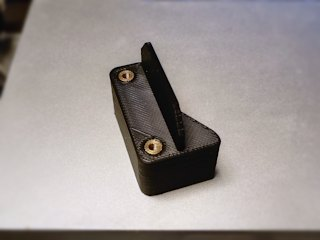
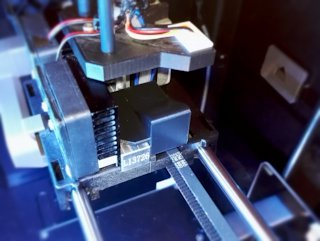

# X endstop trigger for FFCP when printing without right extruder
*Stepper placeholder to trigger the X endstop trigger on the FlashForge Creator Pro (formerly thing:2474664)*

### License
[Creative Commons - Attribution](https://creativecommons.org/licenses/by/4.0/)

### Gallery

[🔎](images/photo1.jpg) [🔎](images/photo2.jpg)

## Description and Instructions

When only printing with one nozzle on the Flashforge Creator Pro or similar printers with two extruders on the same carriage (e.g. the Dreamer or QIDI Tech 1), you can improve print quality considerably by removing the unused heavy extruder stepper motor. Doing so will reduce the weight of the carriage and help to reduce ringing and ripple artifacts on your print. I also recommend to unscrew the unused nozzle to avoid the risk of it bumping into parts of the print.

On printers that have a cooling fan, it is much easier to remove the right stepper than the left. This makes the left extruder the best choice for single extrusion prints. However, the right stepper motor serves an additional function in the printer, namely to trigger the X endstop. If you remove this stepper, you must put something in place. I like the [dummy stepper by race12001](https://www.thingiverse.com/thing:2251192) but still found it too large, therefore I made a more minimal but still sturdy version that is just large enough to trigger the switch. It is easily mounted with the same screws as the stepper itself.

I provide two versions, one that accepts 5×5 mm M3 brass inserts and one with direct holes. The brass inserts are recommended but simply threading the screws into the direct holes should also work, although you risk stripping the holes if you regularly mount and unmount this part.

Another variation omits the extra tab that covers the hot-end hole. This tab may help to avoid that dust or dirt ends up in the hole, although this wouldn't be a problem if you also unscrew the right nozzle when not using it.

### Printing

Print this at 100% infill, although this shouldn't really matter because there are almost no solid volumes anyway.

Recommended layer height is 0.2 mm. Supports are not needed.

I recommend to print this in ABS or PETG, especially if you're going to also print in those materials. Even when printing PLA only, the left stepper can get quite hot and this part might deform if it has been printed in PLA.

### Post-printing

If you want to install the brass inserts, place them over the holes and use a soldering iron or something else to heat them to a temperature that melts the plastic. Then push them into the block against a flat surface. Check with a long M3 screw that they are sufficiently straight, and correct if necessary.

## Updates

### 2017/08/08
First upload to Thingiverse.

## Tags
`endstop`, `extruder`, `FFCP`, `FFCPRo`, `flashforge`, `FlashForge_Dreamer`, `Placeholder`, `Qidi_Tech`, `trigger`
